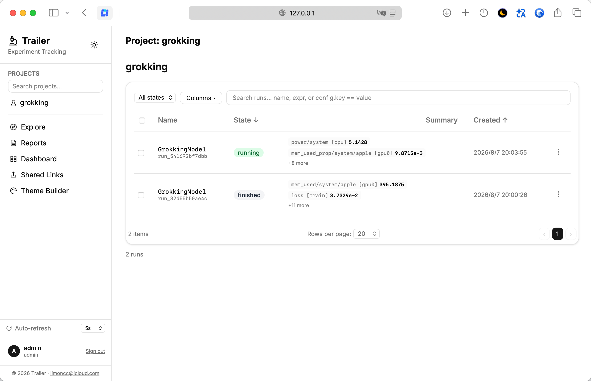
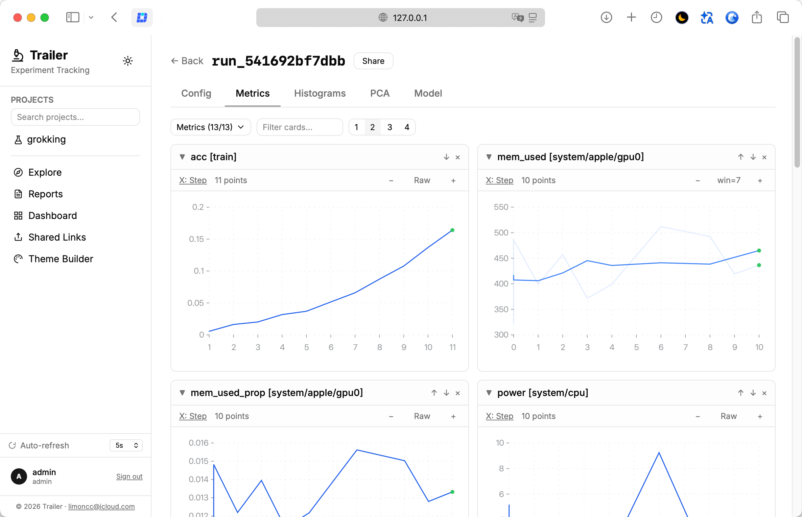
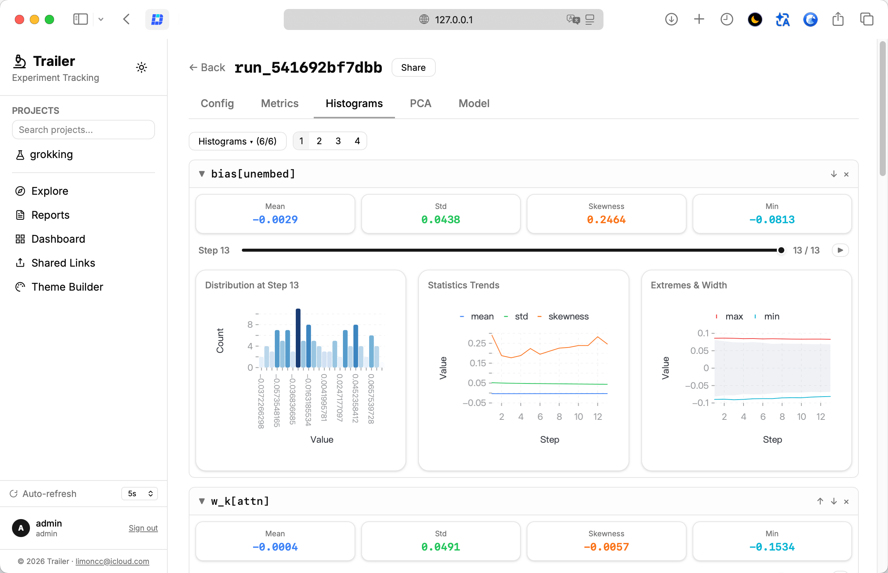
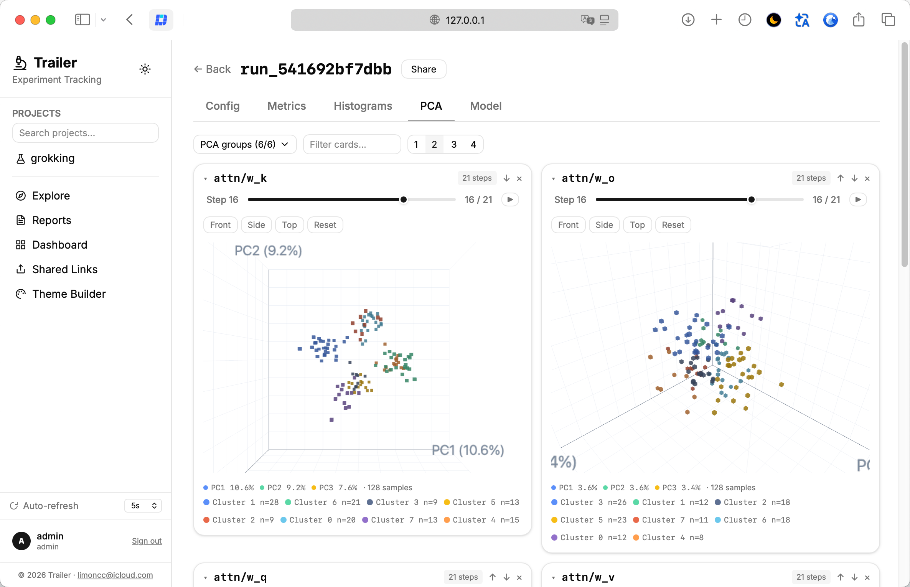
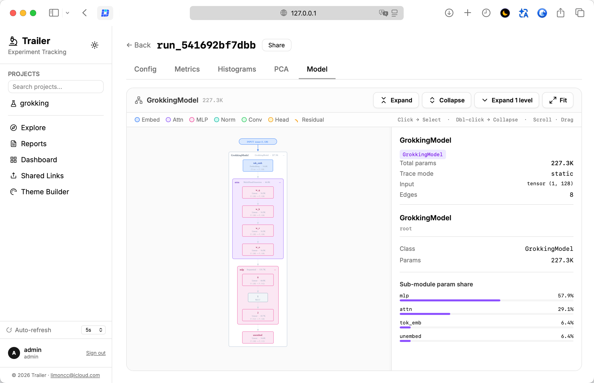
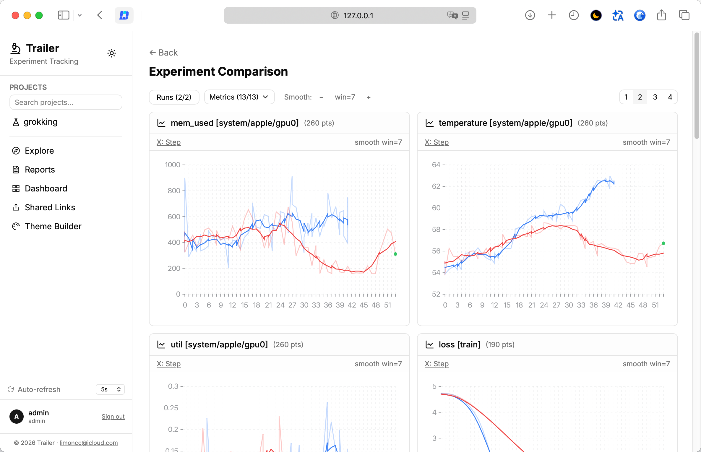
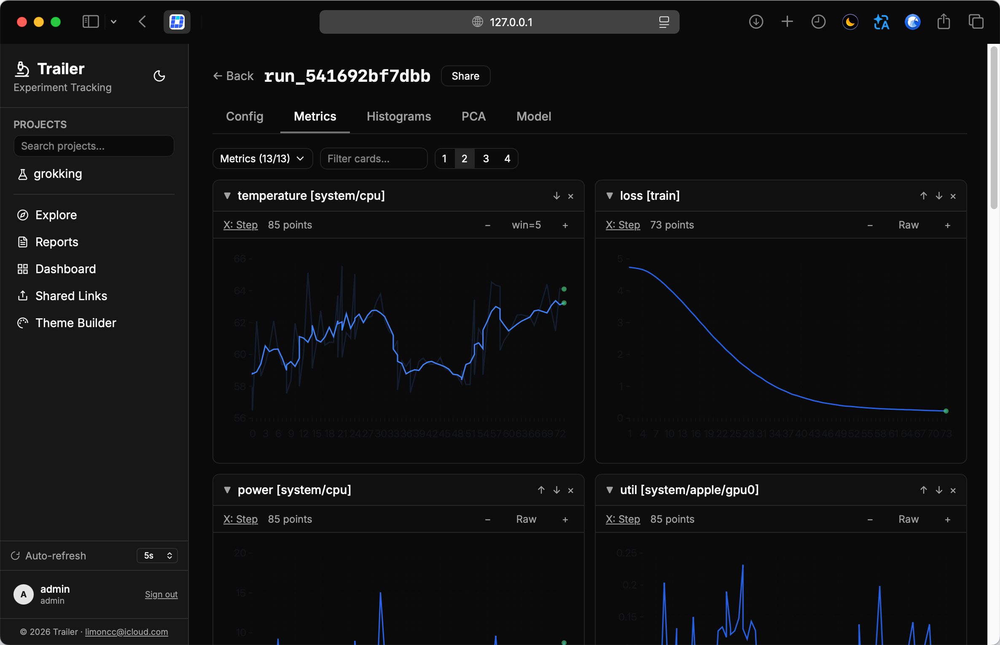
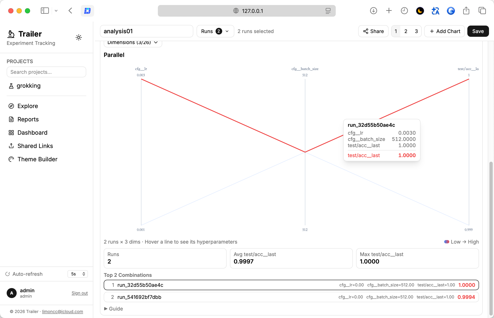
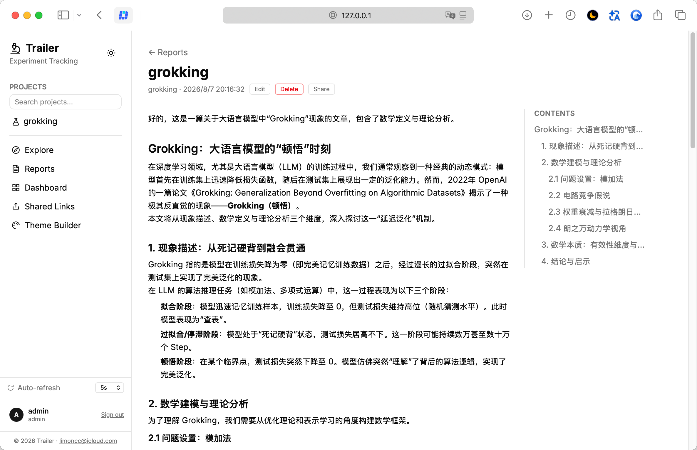

[中文](README.zh-CN.md) | **English**

# Trailer

> Next-gen **ML experiment tracking** — a lightning-fast, open-source experiment tracker with a **high-performance Rust core** and a local-first philosophy.

The ultimate trailer for your deep learning experiments — combining TensorBoard's depth, Aim's fluidity, and W&B's ecosystem, powered by a Rust core.

## Features

- ⚡ **High-performance Rust core** — LTTB downsampling, batched ingestion, 100k-entry ring buffer (P99 < 100µs)
- 📊 **Every data type you need** — scalars, text, figures, tables, media, histograms, embeddings, PCA, and model graphs
- 🚀 **One-command local mode** — `trailer up` starts the full dashboard — zero config, no HTTP overhead, data lands locally
- 🔬 **Cross-project Explore** — line, scatter, and parallel-coordinates charts across runs — saved and shareable
- 🗄️ **Flexible storage** — SQLite (default), PostgreSQL, or TensorBoard-style file mode
- 👥 **Multi-user & permissions** — admin / experimenter roles, anonymous sharing links
- 🔍 **Powerful Compare** — progressive-loading comparison across runs

## Screenshots

  

  

  

## Quick start

```bash
pip install trailer-sdk
```

```python
from trailer import Tracker

t = Tracker(project="my_experiment")
t.log({"train/loss": 0.5, "val/loss": 0.6})
t.finish()
```

Launch the dashboard:

```bash
trailer up          # http://127.0.0.1:5120
```

## Documentation

Full docs (English / 中文): **https://limoncc.github.io/trailer/**

## License

[Elastic License 2.0](LICENSE) — free for internal use; commercial hosting / SaaS requires a separate license. See [LICENSING.md](LICENSING.md).
